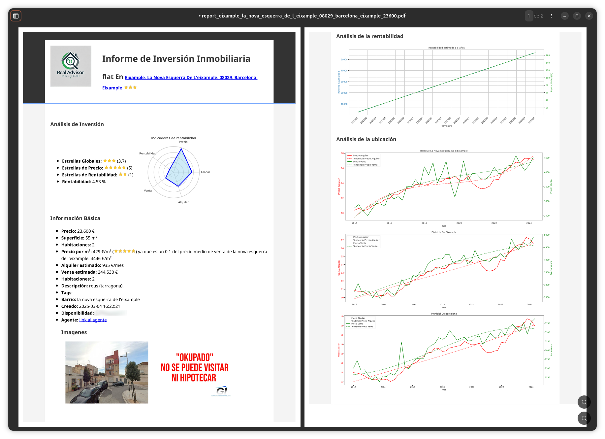

# RealAdvisor

RealAdvisor is a property-scraping, analysis and reporting system for residential real estate. It crawls property portals, normalizes property data into domain objects, computes investment metrics, and generates human-friendly reports (HTML/PDF). It includes a lightweight Gradio-based UI and a daemon/orchestrator for scheduled runs and Telegram notifications.


Key technologies
- Python (data processing, crawling, reporting)
- HTML/Jinja2 templates for reports (several templates under `src/report`)
- pandas, numpy for data manipulation
- pdfkit (wkhtmltopdf) for rendering PDFs from HTML
- seleniumwire2 (Selenium) for scraping dynamic sites
- Jinja2 templating, matplotlib/seaborn for charts
- APScheduler for scheduling (daemon)
- Telegram Bot for notifications (TelegramHandler)
- Gradio for quick UI (`app.py`)
- Dockerfile for containerized runs





High-level architecture
- src/crawler: provider-agnostic Crawler and Scraper that use declarative provider specs (CSV) to extract list/detail pages
- src/report: Reporter, RealtyReport and templating to compute metrics and generate reports
- src/realty.py: domain model (Realty dataclass) and helpers
- src/daemon.py: orchestrator/daemon to schedule crawling/reporting and send notifications
- app.py: simple Gradio UI wrapper to generate a report from a URL (quick demo/interactive mode)
- local datasets & config: provider specs, realties DB, indicators/prices CSVs used by the reporter
- public/, models/: static assets and serialized models (if present)

---

## Getting Started

Prerequisites
- Git
- Python 3.10+ (project uses modern typing; please verify exact version required)
- System packages:
  - wkhtmltopdf (for pdfkit) — install from your OS packages or https://wkhtmltopdf.org/
  - A browser driver for Selenium (Chrome + chromedriver or Firefox + geckodriver) if scraping via Selenium
  - (Optional) Docker (if using containerized run)

Install project
1. Clone the repo:
   git clone https://github.com/germanztz/realadvisor.git
   cd realadvisor

2. Create virtual environment and install Python deps:
   python -m venv .venv
   source .venv/bin/activate
   pip install --upgrade pip
   pip install -r requirements.txt

3. Install system deps:
   - Install wkhtmltopdf and ensure it is in PATH
   - Install a matching browser driver (chromedriver) and make it available in PATH

Configuration
- Copy example configuration and logging:
  cp realadvisor_conf.example.yaml realadvisor_conf.yaml
  cp logging.example.conf logging.conf
- Edit `realadvisor_conf.yaml` to set:
  - paths for datasets (webs_specs, realties, indicadores, precios)
  - Telegram bot token & chat_id (if using notifications)
  - scheduler/dry_run and crawler delays
- Example service script: `realadvisor_service.example.sh` can be adapted to run the daemon as a system service.

Running the app (local / development)
- Quick UI (Gradio):
  python app.py
  (This should launch a Gradio interface to generate a single-property report — confirm behavior after launching.)

- Run the daemon/orchestrator:  
```
  # either use the run script (make it executable)
  ./run.sh  
  # or run the daemon script directly (verify CLI options)
  python src/daemon.py --config realadvisor_conf.yaml
```
- Docker:
```
  docker build -t realadvisor .
  docker run --rm -v $(pwd)/local:/app/local -v $(pwd)/reports:/app/reports realadvisor
```
Running tests
- There is a `tests/` directory. If tests are implemented, run:
  pytest -q
- If the test suite is not present/complete, add tests for `Realty`, `Scraper` parsers, and `Reporter.compute_reports`.
- Note: I could not find explicit test runners or CI config — please verify and add `.github/workflows` if CI is desired.

---

## Project Structure

Top-level files
- Dockerfile — project containerization
- requirements.txt — Python dependencies
- run.sh — convenience script to start the service/daemon
- realadvisor_conf.example.yaml — example configuration
- logging.example.conf — example logging config
- realadvisor_service.example.sh — sample systemd/service startup script
- app.py — Gradio UI for generating reports interactively
- README.md — (this file)

Top-level directories
- src/ — main Python source code
  - realty.py — Realty dataclass (domain model)
  - daemon.py — Daemon / orchestrator class that loads config, initializes components and scheduling
  - telegram_handler.py — custom logging handler to forward logs to Telegram
  - crawler/ — provider crawling logic
    - crawler.py — Crawler orchestration, provider specs loader
    - scraper.py — Scraper that performs the HTTP/Selenium extraction
    - (other provider-specific scrapers / helpers may live here)
  - report/ — reporting and templating
    - reporter.py — Reporter class: load data, compute RealtyReport(s), render HTML/PDF
    - realty_report.py — RealtyReport dataclass (extends Realty with market metrics)
    - report_template*.html / .md — Jinja2 templates for generating reports
    - report.ipynb — exploratory notebook
- public/ — static assets (images, frontend files)
- models/ — persisted ML models or serialized artifacts (if used)
- local/ (expected) — datasets and caches (not always present in repo)
- tests/ — test suite (if present)

Important configuration files
- realadvisor_conf.example.yaml — main config (daemon, crawler, reporter options)
- logging.example.conf — logger configuration (console/file/telegram handlers)

Key files summary
- src/realty.py — clean domain model with parsing helpers for price/fields
- src/crawler/scraper.py — main scraping logic (Selenium + requests strategies, caching)
- src/crawler/crawler.py — reads provider specs (CSV) and orchestrates list/detail extraction
- src/report/reporter.py — builds RealtyReport objects and outputs HTML/PDF
- src/report/realty_report.py — calculates market indicators, matching place/barrio, rating logic
- src/daemon.py — orchestrates runs and sends reports via Telegram

---

## Development Workflow

Coding conventions & style
- Follow Python 3 typing hints and dataclasses style used in the repo
- Keep business logic in src/* and templates in src/report
- Use descriptive logging (modules use logging.getLogger)
- Use the provider specs CSV to add/modify crawling behavior instead of hard-coding scrapers

Testing
- Add unit tests for:
  - Realty parsing & price normalization (edge formats)
  - Scraper regex/lambda field extraction using sample HTML
  - Reporter metrics computation (RealtyReport calculations)
- Use pytest; add test fixtures for sample CSVs in `tests/fixtures`

Build & deployment
- Dockerfile present — use it to produce reproducible environments
- Deployment options:
  - Run as a container (Docker) mapping dataset/cache/report directories
  - Use a systemd service (see `realadvisor_service.example.sh`)
  - For scheduled execution, prefer daemon + APScheduler rather than OS cron for tighter integration and Telegram alerts

Contribution guidelines (suggested)
- Fork the repo and open feature branches named `feat/<short-desc>` or `fix/<short-desc>`
- Run and add unit tests for all new features/bug fixes
- Follow PEP8; consider integrating a pre-commit config (black, isort, flake8)
- Open PRs with clear description, before/after screenshots (if UI), and tests

---

## Key Concepts

Domain terminology
- Realty: core domain object representing a property (address, price, rooms, surface, images, tags)
- RealtyReport: enriched Realty instance with market indicators (precio_venta_1y, rentabilidad_10y, barrio, stars)
- Provider specs: declarative CSV that defines regexes and lambdas needed to extract list/detail fields per provider
- Reports: generated HTML and PDF outputs per property with scores and metrics

Core abstractions
- Crawler: high-level orchestrator that uses provider specs to build a dataset of realties
- Scraper: low-level extractor that applies regex/lambdas, handles caching and Selenium when needed
- Reporter: converts Realty -> RealtyReport, matches barrio/indicators and renders templates (HTML -> PDF)
- Daemon: keeps scheduling, runs crawls and report generation, and sends notifications via Telegram

Design patterns used
- Data-driven scraping: provider behavior encoded in CSVs (regexes/lambdas)
- Dataclass models for domain objects
- Template-based reporting (Jinja2)
- Separation of concerns: crawling vs reporting vs orchestration

---

## Common Tasks

1. Add a new provider to the crawler
- Edit `local/datasets/webs_specs.csv` (or wherever `webs_specs_datafile_path` points)
- Add entries for provider `base_url`, `list_items` regex, `list_field` regexes and `detail_field` regexes
- Optionally provide lambda processors via `type=lambda` entries
- Run a dry-run crawl:
  python -c "from src.crawler import Crawler; Crawler().crawl_provider('newprovider', dry_run=True)"

2. Generate reports for pending realties
- Start reporter in interactive:
  python -c "from src.reporter import Reporter; Reporter().compute_reports(Reporter().get_pending_realies())"
- Or run the daemon to perform full flow:
  ./run.sh

3. Launch the Gradio UI
- python app.py
- Use the UI to paste a property URL and generate a single report (useful for testing)

4. Build & run Docker image
- docker build -t realadvisor .
- docker run --rm -v $(pwd)/local:/app/local -v $(pwd)/reports:/app/reports realadvisor

5. Update templates
- Templates live under `src/report`. Edit `report_template.html` and preview with `report.ipynb` or generate via Reporter.

---

## Troubleshooting

Common issues & fixes
- PDF generation fails (pdfkit / wkhtmltopdf)
  - Ensure wkhtmltopdf is installed and accessible.
  - Verify `pdfkit.configuration(wkhtmltopdf='path/to/wkhtmltopdf')` if needed.
  - Check for unsupported CSS or very large images.

- Selenium issues / driver errors
  - Ensure the browser binary (Chrome/Chromium) and matching chromedriver are installed and in PATH.
  - Verify versions match; if headless in Docker, ensure required libraries are present.

- Permission denied when writing reports
  - Ensure `output_dir` exists and has write permissions; `Reporter` attempts to chmod output dir — verify container/user permissions.

- Missing datasets (indicadores, precios)
  - Reporter raises FileNotFoundError if indicator CSVs are missing. Provide `datasets/gen_indicadores.csv` and `datasets/gen_precios.csv` or adjust paths in config.

- Telegram notifications failing
  - Ensure `bot_token` and `chat_id` are valid in the config.
  - Check network access and that the Telegram API is reachable.

Debugging tips
- Enable verbose logging by using `logging.example.conf` and increasing log level for modules (crawler, reporter)
- Use `python -i` to import classes and run functions interactively
- Unit-test regexes and lambda processors against stored sample HTML snippets

---

## References & Resources

- Project repository: https://github.com/germanztz/realadvisor
- Gradio: https://gradio.app/
- pdfkit + wkhtmltopdf: https://github.com/JazzCore/python-pdfkit and https://wkhtmltopdf.org/
- Selenium & selenium-wire2: https://www.selenium.dev/ and https://github.com/wkeeling/selenium-wire
- pandas & numpy: https://pandas.pydata.org/, https://numpy.org/
- Jinja2 templating: https://jinja.palletsprojects.com/
- APScheduler: https://apscheduler.readthedocs.io/

---

## Notes, Assumptions & To-Verify

Areas I made reasonable assumptions that should be verified:
- Python version: assumed 3.10+ due to type annotations and list[T] usage — please confirm and update `pyproject`/CI if required.
- Exact CLI entrypoints: `app.py` appears to launch Gradio, and `run.sh` exists to start the daemon — confirm expected usage and arguments for `daemon.py`.
- Tests & CI: tests directory exists but may be incomplete or empty — confirm test framework and CI pipelines.
- System dependencies: wkhtmltopdf and a Selenium web driver are required — verify supported OS install instructions.

---

What I did and next steps

I inspected the repository structure and key files (notably `src/realty.py`, `src/crawler/*`, `src/report/*`, `src/daemon.py`, `app.py`, and the configuration/example files). Using that analysis I created this comprehensive README that explains purpose, how components fit together, installation and development workflows, common tasks, troubleshooting and references. Please review the sections marked "To-Verify" and update any commands/config values to match your environment. If you want, I can:
- generate a ready-to-commit README.md PR,
- add a CONTRIBUTING.md or a basic GitHub Actions CI workflow,
- or produce small utilities (e.g., a `manage.py` CLI) to standardize common tasks.

Please review and edit the README as needed before committing.

### TODO

- datos: actualizar datos precios
- informe: enviar cada informe en markdown por telegram

### Changelog

- env: eliminar datos del repo
- datos: añadir reported date a realty_report
- env: ejecutar job 4 veces a aprtir de las 10 o a horas concretas 10:00, 14:00, 18:00, 22:00
- env: añadir como servicio en htpc
- informe: corregir exceso de decimales en la rentabilidad 
- informe: Añadir agencia
- informe y datos: Añadir link a imagenes
- informe: cambiar nombre del merged.pdf y añadir mensaje
- informe: Eliminar el NAN del titulo
- datos: pasar el creation date a lambda
- env: Eliminar chat_id del repo

## Docker Installation and Configuration


This error occurs because the Docker daemon isn't running or you don't have the proper permissions. Let's fix this with these steps:

1. First, check if Docker service is running:
```bash
sudo systemctl status docker
```

2. If it's not running, start it:
```bash
sudo systemctl start docker
```

3. Add your user to the docker group to avoid using sudo for docker commands:
```bash
# Add your user to docker group
sudo usermod -aG docker $USER

# Verify your user is in the docker group
groups
```

4. Apply the changes:
```bash
# Reload groups without logging out
newgrp docker
```

If you still get the error, try these additional steps:

1. Restart the Docker daemon:
```bash
sudo systemctl restart docker
```

2. Make sure the Docker socket has the correct permissions:
```bash
sudo chmod 666 /var/run/docker.sock
```

After making these changes, try running your script again:
```bash
./run.sh
```

If you're still having issues, you might need to log out and log back in for the group changes to take effect completely.

Note: The `chmod 666` solution is temporary and will reset after a system restart. The proper solution is ensuring your user is in the docker group.


---


If Git is not ignoring a file despite it being listed in `.gitignore`, it's likely because the file was already tracked by Git before being added to `.gitignore`. The `.gitignore` file only works for untracked files.

To fix this, you need to:

1. First, remove the file from Git's tracking (but keep it on your disk):
```bash
git rm --cached report/reports/property_report_Eixample.html
```

2. Make sure your `.gitignore` entry is correct (it looks fine in your case):
```gitignore
report/reports/property_report_Eixample.html
```

3. Commit the changes:
```bash
git add .gitignore
git commit -m "Stop tracking property_report_Eixample.html"
```

After these steps, Git will stop tracking the file, and it will be properly ignored. The file will remain on your local system but won't be included in future commits.

Note: If you want to ignore all HTML files in that directory, you could use a pattern instead:
```gitignore
report/reports/*.html
```
